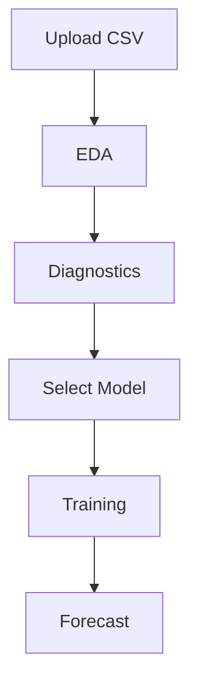

# 📈 Apple Stock Price Forecasting System

<div align="center">


### 🚀 Advanced Interactive Financial Forecasting Dashboard using

### SARIMA • Random Forest • XGBoost • GRU • LSTM

</div>

---

# ✨ Overview

The **Apple Stock Price Forecasting System** is a complete end-to-end financial time series forecasting application built using **Streamlit**, **Machine Learning**, **Deep Learning**, and **Statistical Modeling** techniques.

This system enables users to:

✅ Upload stock datasets
✅ Perform exploratory data analysis (EDA)
✅ Conduct statistical diagnostics
✅ Train multiple forecasting models
✅ Compare performance metrics
✅ Forecast future stock prices interactively

The application supports:

* 📊 Statistical Time Series Models
* 🌲 Machine Learning Models
* 🧠 Deep Learning Models
* 📈 Interactive Visualizations
* ⚡ Automated Workflow Pipeline

---

# 🎯 Key Features

## 🔥 Interactive 6-Step Forecasting Pipeline

| Step | Module          | Description                    |
| ---- | --------------- | ------------------------------ |
| 1️⃣  | Upload Data     | Upload CSV stock dataset       |
| 2️⃣  | EDA             | Exploratory Data Analysis      |
| 3️⃣  | Diagnostics     | Statistical Hypothesis Testing |
| 4️⃣  | Model Selection | Choose Forecasting Model       |
| 5️⃣  | Training        | Model Training & Auto-Tuning   |
| 6️⃣  | Forecast        | Future Price Prediction        |

---

# 🧠 Models Implemented

## 📌 Statistical Model

* SARIMA (Seasonal AutoRegressive Integrated Moving Average)

## 📌 Machine Learning Models

* Random Forest Regressor
* XGBoost Regressor

## 📌 Deep Learning Models

* GRU Neural Network
* LSTM Neural Network

---

# 📂 Project Structure

```bash
📦 Apple-Stock-Forecasting-System
│
├── app.py
├── requirements.txt
├── AAPL.csv
└── README.md
```

---

# ⚙️ Tech Stack

## 👨‍💻 Frontend

* Streamlit

## 🧪 Data Analysis

* Pandas
* NumPy

## 📊 Visualization

* Plotly
* Matplotlib

## 🤖 Machine Learning

* Scikit-learn
* XGBoost

## 🧠 Deep Learning

* TensorFlow / Keras

## 📈 Statistical Analysis

* Statsmodels
* SciPy

---

# 🧩 Forecasting Workflow



---

# 📈 Performance Metrics

The system evaluates:

* MAE (Mean Absolute Error)
* RMSE (Root Mean Squared Error)
* Price-Based MAE
* Price-Based RMSE
* Overfitting / Underfitting Detection

---

# 🧪 Statistical Testing

The application automatically validates time series properties before modeling.

## Tests Included

| Test             | Purpose            |
| ---------------- | ------------------ |
| ADF Test         | Stationarity       |
| Jarque-Bera Test | Normality          |
| Ljung-Box Test   | Autocorrelation    |
| ARCH Test        | Heteroskedasticity |

---

# 🤖 Deep Learning Architecture

## 🔹 GRU Model

```python
GRU(32, return_sequences=True)
GRU(16)
Dense(1)
```

---

## 🔹 LSTM Model

```python
LSTM(64, return_sequences=True)
Dropout(0.3)
LSTM(32)
Dropout(0.3)
Dense(1)
```

---

# 📊 Forecast Visualization

The forecast module includes:

✅ Interactive Plotly Charts
✅ Historical vs Forecast Comparison
✅ Forecast Tables
✅ Future Date Generation

---

# 🚀 Installation

## 1️⃣ Clone Repository

```bash
git clone https://github.com/7-vsd/apple-stock-forecasting.git
cd apple-stock-forecasting
```

---

## 2️⃣ Create Virtual Environment

### Windows

```bash
python -m venv venv
venv\Scripts\activate
```

### Linux / Mac

```bash
python3 -m venv venv
source venv/bin/activate
```

---

## 3️⃣ Install Dependencies

```bash
pip install -r requirements.txt
```

---

# ▶️ Run Application

```bash
streamlit run app.py
```

---

# 📁 Dataset Format

The CSV file should contain:

| Date       | Close |
| ---------- | ----- |
| 2024-01-01 | 185.2 |
| 2024-01-02 | 186.5 |

---

# 📦 Requirements

```txt
streamlit
pandas
numpy
scikit-learn
statsmodels
xgboost
tensorflow
plotly
matplotlib
scipy
```

---

# 🧠 Core Functionalities

## ✔ Data Preprocessing

* Date parsing
* Sorting
* Missing value handling
* Return generation

## ✔ Auto-Tuning

Automatic hyperparameter optimization using GridSearchCV.

## ✔ Forecast Generation

Future stock price prediction using:

* Historical volatility
* Model-generated returns
* Stochastic adjustment

---

# 📉 Error Handling

The system detects:

| Condition    | Meaning             |
| ------------ | ------------------- |
| Overfitting  | Train error too low |
| Underfitting | Poor training       |
| Balanced     | Good generalization |

---

# 📌 Future Improvements

🚀 Real-time stock API integration
🚀 Multi-stock forecasting
🚀 Transformer models
🚀 Attention mechanisms
🚀 Sentiment analysis integration
🚀 GPU acceleration
🚀 Model persistence

---

# 🔒 Disclaimer

This project is intended for:

* Educational purposes
* Research purposes
* Learning financial forecasting

It should NOT be considered financial advice.

---

# 👨‍💻 Author

## VIPUL DHANGE

### 📧 Contact

* GitHub: [7-vsd GitHub Profile](https://github.com/7-vsd?utm_source=chatgpt.com)
* LinkedIn: [Vipul Dhange LinkedIn](https://www.linkedin.com/in/vipul-dhange-827b14253/?utm_source=chatgpt.com)

---

# ⭐ Support

If you found this project useful:

🌟 Star the repository
🍴 Fork the project
📢 Share with others

---

# 📜 License

This project is licensed under the MIT License.

---

# 🏆 Why This Project Stands Out

✅ Combines Statistics + ML + DL
✅ Interactive Dashboard
✅ Professional Workflow
✅ Financial Time Series Diagnostics
✅ End-to-End Pipeline
✅ Modern UI
✅ Production-Level Architecture

---

# 📚 Source Files

* Main Application: 
* Dependencies: 
